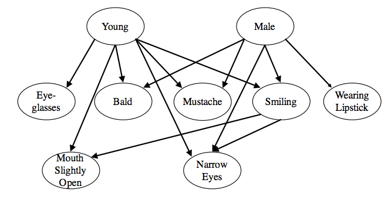

# Counterfactuals over GANs

## Overview

GANs take independent noise and create movel samples from a distribution that looks like the real distribution they're trained on.

What if we sample small perturbations to a given random noise state, and then condition on that distribution?
We think we might get counterfactuals.

Concretely, if we have a way of determining for each image how likely it is to be female and how likely it is to have a mustache (e.g. a classifier for each label), we can first conditionally sample a femal face from the prior, and *then* counterfactually imagine what she would look like if she had a mustache.

We implement the counterfactual sampling procedure from [An improved probabilistic account of counterfactual reasoning](https://philpapers.org/rec/LUCAIP) on the noise vector input to the GAN to create the "actual" woman's face to create the counterfactual distribution over her "counterfactual" faces with a mustache.

## Queries

* Given a woman, what if she had a moustache?
* Given a man, what if he were wearing lipstick?
* Given a woman, what if she were a man?
* Given a young man, what if he were bald?
* Given a person who's not wearing glasses, what if they were wearing glasses?
* Given a person who's not smiling, what if they were smiling?

## What if this doesn't work?

If this doesn't work, it means that the GAN doesn't know the causal structure.
Maybe we can tell it things, like "If this young man were old, he might be bald," *while* it's training.
Would that help it learn better causal structures?

## Dataset

Download [Celeb A](http://mmlab.ie.cuhk.edu.hk/projects/CelebA.html) datasets.

CelebFaces Attributes Dataset (CelebA) is a large-scale face attributes dataset with more than 200K celebrity images, each with 40 attribute annotations. The images in this dataset cover large pose variations and background clutter. CelebA has large diversities, large quantities, and rich annotations, including

* 10,177 number of identities,
* 202,599 number of face images, and
* 5 landmark locations, 40 binary attributes annotations per image.

Attributes:

* `5_o_Clock_Shadow`
* `Arched_Eyebrows`
* `Attractive`
* `Bags_Under_Eyes`
* `Bald`
* `Bangs`
* `Big_Lips`
* `Big_Nose`
* `Black_Hair`
* `Blond_Hair`
* `Blurry`
* `Brown_Hair`
* `Bushy_Eyebrows`
* `Chubby`
* `Double_Chin`
* `Eyeglasses`
* `Goatee`
* `Gray_Hair`
* `Heavy_Makeup`
* `High_Cheekbones`
* `Male`
* `Mouth_Slightly_Open`
* `Mustache`
* `Narrow_Eyes`
* `No_Beard`
* `Oval_Face`
* `Pale_Skin`
* `Pointy_Nose`
* `Receding_Hairline`
* `Rosy_Cheeks`
* `Sideburns`
* `Smiling`
* `Straight_Hair`
* `Wavy_Hair`
* `Wearing_Earrings`
* `Wearing_Hat`
* `Wearing_Lipstick`
* `Wearing_Necklace`
* `Wearing_Necktie`
* `Young`

## Causal structure

[CausalGAN: Learning Causal Implicit Generative Models
with Adversarial Training](https://arxiv.org/pdf/1709.02023.pdf) gives a nice, intuitive causal structure for the CelebA dataset.



They train their model to be able to sample novel images while conditioning on a given set of discrete labels (maintaining causal relationships), or while changing the labels by intervention (creating implausible but imaginable samples).

## Pre-trained GAN

https://github.com/carpedm20/DCGAN-tensorflow

```
python download.py celebA
python main.py --dataset celebA --input_height=108 --crop
```

## Possible timeline

* Week 1 ~ set up environment
	- Alex: 
		* [ ] python 3
		* [ ] tensorflow 0.12.1
		* [ ] download and run [GAN](https://github.com/carpedm20/DCGAN-tensorflow)
		* [ ] we *might* need access to `cocoserv2`
	- Erin
		* [ ] make repo & integrate with slack
* Week 2-3 counterfactually sample from GAN
	* [ ] find where the noise vector is passed in and be able to modify it
	* [ ] pick a base image
	* [ ] write version of ESM model for changing GAN noise input
	* [ ] sample counterfactual distribution for that base image
* Week 4-5 ~ classifiers
	* [ ] download [data](http://mmlab.ie.cuhk.edu.hk/projects/CelebA.html)
		- describe exact format of data
	* [ ] quick lit review of things people have done with this dataset
	* [ ] decide on architecture (probably convolutional NN)
	* [ ] decide on a subset of features to look at
		- maybe reference https://arxiv.org/pdf/1709.02023.pdf
	* [ ] train some classifiers on those features
* Week 6 ~ conditionally sample from GAN
	- should we use pyro?
* Week 7 ~ condition on specific counterfactuals

## Some references/papers

* read about probabilistic models, e.g. http://probmods.org/
* read about probabilistic programming languages, e.g. http://dippl.org/
* read about DCGANs, e.g. https://arxiv.org/abs/1511.06434
* keeping reading through counterfactual model: https://philpapers.org/rec/LUCAIP
* read about causal structure in GANs, e.g. https://arxiv.org/pdf/1709.02023.pdf

## Classifiers

???

## Extras

[Neural Face](http://carpedm20.github.io/faces/) uses a vector `z` that consists of 100 real numbers ranging from 0 to 1.
They visualize what happens when each element in the noise vector is changed.


